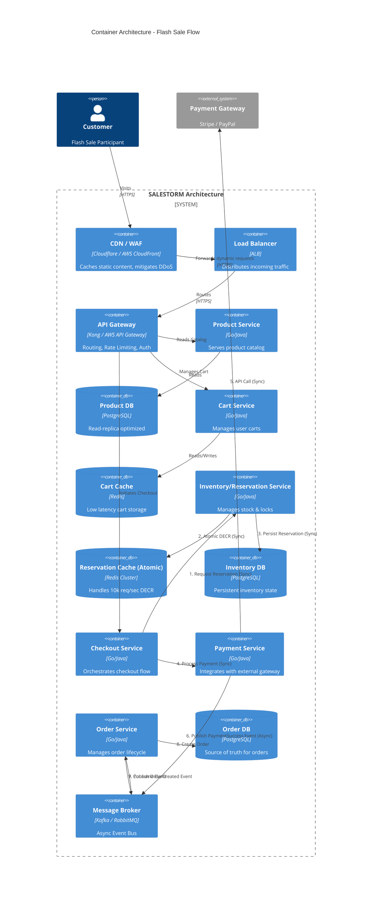

```mermaid
C4Container
title Container Architecture - Flash Sale Flow

Person(customer, "Customer", "Flash Sale Participant")
System_Boundary(c1, "SALESTORM Architecture") {
    Container(cdn, "CDN / WAF", "Cloudflare / AWS CloudFront", "Caches static content, mitigates DDoS")
    Container(lb, "Load Balancer", "ALB", "Distributes incoming traffic")
    Container(api_gw, "API Gateway", "Kong / AWS API Gateway", "Routing, Rate Limiting, Auth")

    Container(product_svc, "Product Service", "Go/Java", "Serves product catalog")
    ContainerDb(product_db, "Product DB", "PostgreSQL", "Read-replica optimized")

    Container(cart_svc, "Cart Service", "Go/Java", "Manages user carts")
    ContainerDb(cart_cache, "Cart Cache", "Redis", "Low latency cart storage")

    Container(inventory_svc, "Inventory/Reservation Service", "Go/Java", "Manages stock & locks")
    ContainerDb(inventory_redis, "Reservation Cache (Atomic)", "Redis Cluster", "Handles 10k req/sec DECR")
    ContainerDb(inventory_db, "Inventory DB", "PostgreSQL", "Persistent inventory state")

    Container(checkout_svc, "Checkout Service", "Go/Java", "Orchestrates checkout flow")
    
    Container(payment_svc, "Payment Service", "Go/Java", "Integrates with external gateway")
    
    Container(order_svc, "Order Service", "Go/Java", "Manages order lifecycle")
    ContainerDb(order_db, "Order DB", "PostgreSQL", "Source of truth for orders")
    
    Container(msg_broker, "Message Broker", "Kafka / RabbitMQ", "Async Event Bus")
}

System_Ext(payment_gw, "Payment Gateway", "Stripe / PayPal")

Rel(customer, cdn, "Visits", "HTTPS")
Rel(cdn, lb, "Forwards dynamic requests", "HTTPS")
Rel(lb, api_gw, "Routes", "HTTPS")

Rel(api_gw, product_svc, "Reads Catalog")
Rel(product_svc, product_db, "Reads")

Rel(api_gw, cart_svc, "Manages Cart")
Rel(cart_svc, cart_cache, "Reads/Writes")

Rel(api_gw, checkout_svc, "Initiates Checkout")
Rel(checkout_svc, inventory_svc, "1. Request Reservation (Sync)")
Rel(inventory_svc, inventory_redis, "2. Atomic DECR (Sync)")
Rel(inventory_svc, inventory_db, "3. Persist Reservation (Sync)")

Rel(checkout_svc, payment_svc, "4. Process Payment (Sync)")
Rel(payment_svc, payment_gw, "5. API Call (Sync)")

Rel(payment_svc, msg_broker, "6. Publish PaymentSuccess Event (Async)")
Rel(msg_broker, order_svc, "7. Consume Event")
Rel(order_svc, order_db, "8. Create Order")
Rel(order_svc, msg_broker, "9. Publish OrderCreated Event")
```
