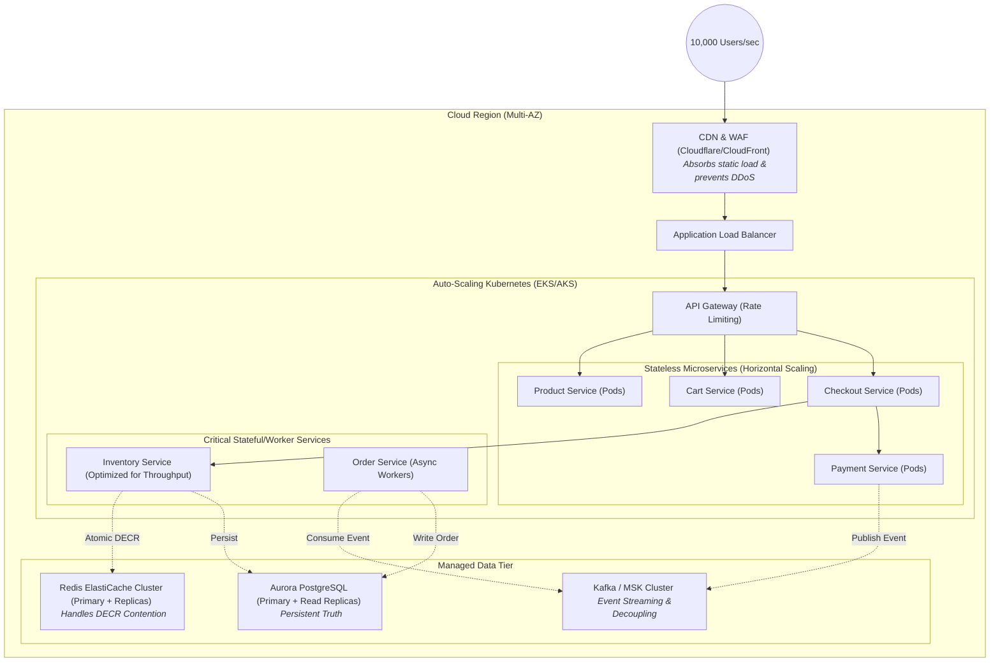

```mermaid
graph TD
    subgraph "Cloud Region (Multi-AZ)"
        CDN["CDN & WAF (Cloudflare/CloudFront) <br/> <i>Absorbs static load & prevents DDoS</i>"]
        ALB["Application Load Balancer"]
        
        subgraph "Auto-Scaling Kubernetes (EKS/AKS)"
            API_GW["API Gateway (Rate Limiting)"]
            
            subgraph "Stateless Microservices (Horizontal Scaling)"
                PROD_SVC["Product Service (Pods)"]
                CART_SVC["Cart Service (Pods)"]
                CHK_SVC["Checkout Service (Pods)"]
                PAY_SVC["Payment Service (Pods)"]
            end
            
            subgraph "Critical Stateful/Worker Services"
                INV_SVC["Inventory Service (Optimized for Throughput)"]
                ORD_SVC["Order Service (Async Workers)"]
            end
        end
        
        subgraph "Managed Data Tier"
            REDIS_CLUSTER["Redis ElastiCache Cluster (Primary + Replicas) <br/> <i>Handles DECR Contention</i>"]
            KAFKA_CLUSTER["Kafka / MSK Cluster <br/> <i>Event Streaming & Decoupling</i>"]
            RDS_CLUSTER["Aurora PostgreSQL (Primary + Read Replicas) <br/> <i>Persistent Truth</i>"]
        end
    end
    
    Internet(("10,000 Users/sec")) --> CDN
    CDN --> ALB
    ALB --> API_GW
    API_GW --> PROD_SVC
    API_GW --> CART_SVC
    API_GW --> CHK_SVC
    
    CHK_SVC --> INV_SVC
    CHK_SVC --> PAY_SVC
    
    INV_SVC -.->|Atomic DECR| REDIS_CLUSTER
    INV_SVC -.->|Persist| RDS_CLUSTER
    
    PAY_SVC -.->|Publish Event| KAFKA_CLUSTER
    ORD_SVC -.->|Consume Event| KAFKA_CLUSTER
    ORD_SVC -.->|Write Order| RDS_CLUSTER
```
