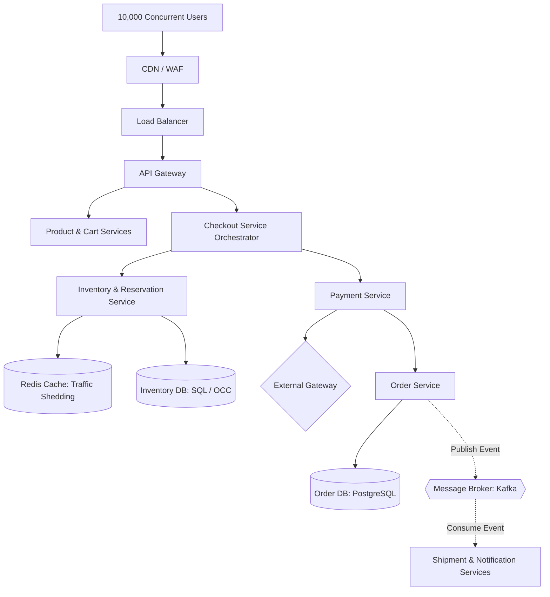

```mermaid
graph TD
    A[10,000 Concurrent Users] --> B[CDN / WAF]
    B --> C[Load Balancer]
    C --> D[API Gateway]
    D --> E[Product & Cart Services]
    D --> F[Checkout Service Orchestrator]
    F --> G[Inventory & Reservation Service]
    F --> H[Payment Service]
    G --> I[(Redis Cache: Traffic Shedding)]
    G --> J[(Inventory DB: SQL / OCC)]
    H --> K{External Gateway}
    H --> L[Order Service]
    L --> M[(Order DB: PostgreSQL)]
    L -.->|Publish Event| N{{Message Broker: Kafka}}
    N -.->|Consume Event| O[Shipment & Notification Services]
```
