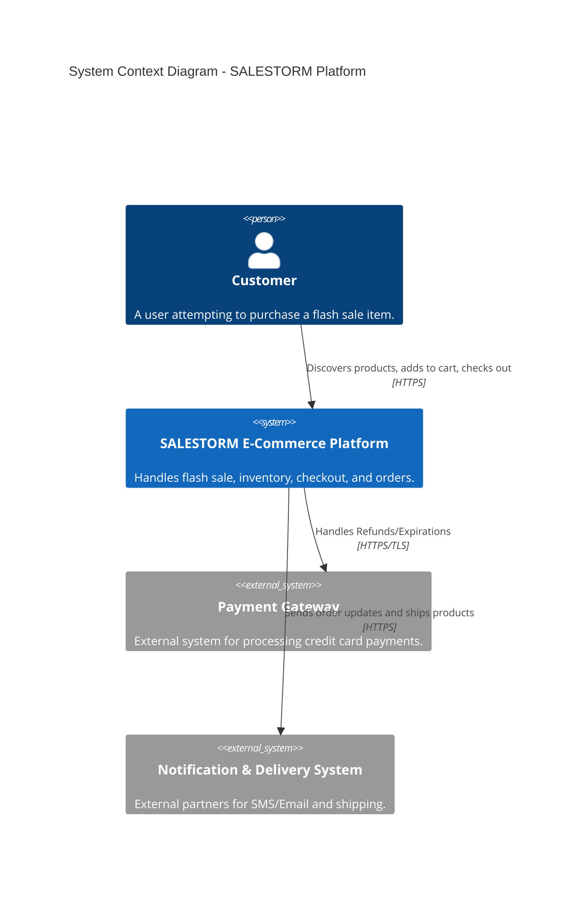
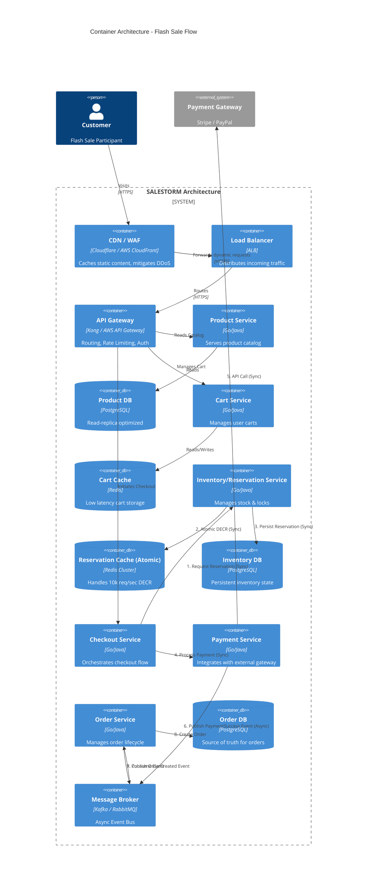
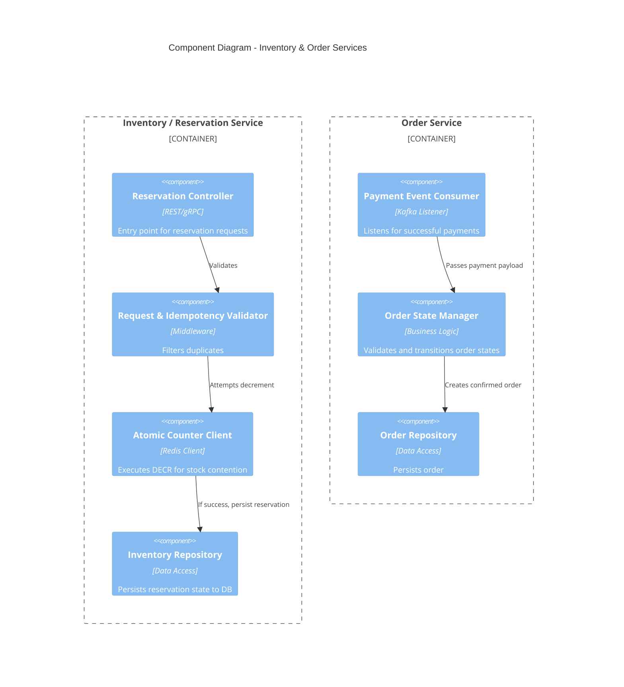
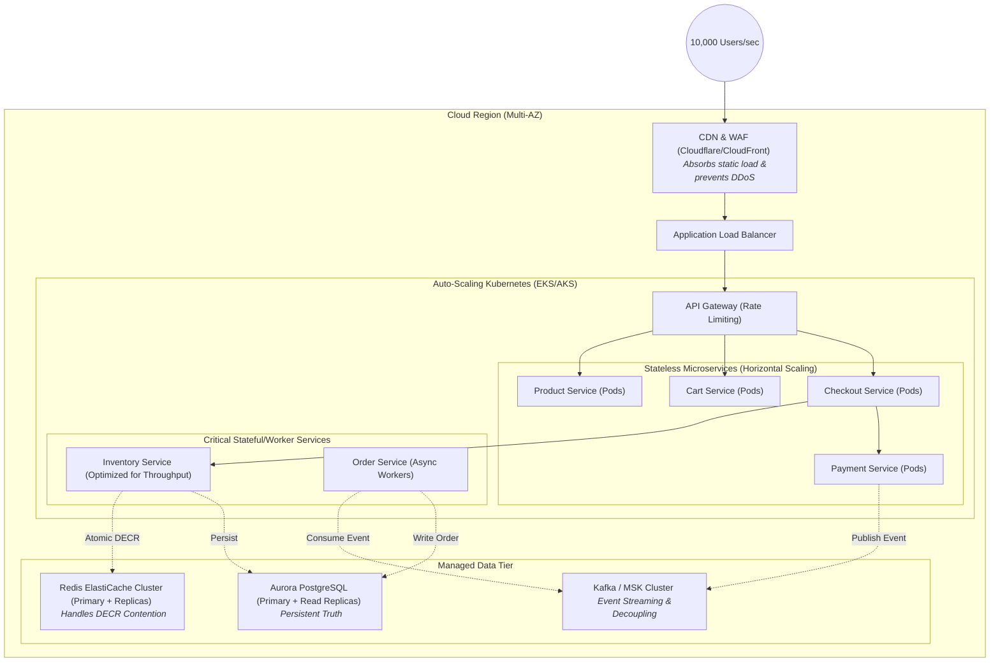

# Phase 2: High-Level Design (HLD)

## 1. System Context Diagram
*This diagram illustrates the highest-level view of the SALESTORM platform and its external dependencies.*

## 2. Container & Service Architecture Diagram
*This maps out the flow from the edge (CDN/WAF) down to the microservices, databases, and message queues.*

## 3. Component Diagram: Inventory & Order Services
*A zoomed-in look at the critical internal workings of our Inventory and Order modules.*

## 4. Deployment Diagram
*Physical deployment strategy targeting the 10,000 req/sec spike.*

---

## 5. Architectural Defense (Mandatory Jury Requirements)

### A. Communication Flow
* **Synchronous Flow (The Critical Path):** 
  * `Client → API Gateway → Checkout Service`: The user must wait for the checkout response.
  * `Checkout Service → Inventory Service`: Securing the item using the Redis `DECR` command **must** be strictly synchronous. If the counter drops below zero, we must instantly fail the request synchronously and alert the user they missed out.
  * `Checkout Service → Payment Gateway`: We must wait for authorization/capture synchronously before proceeding, as we cannot guarantee stock without guaranteed funds.
* **Asynchronous Flow (The Background Path):**
  * `Payment Service → Message Queue (Kafka) → Order Service`: Once payment is confirmed, creating the final Order record is decoupled asynchronously. This speeds up the user's response time and guarantees eventual consistency even if the Order Service is temporarily down.
  * `Order Service → Notification Service`: Sending the "Order Confirmed" email happens entirely asynchronously in the background.

### B. Bottleneck Analysis & Component Justification
1. **Bottleneck: Database Row Locking (Inventory Contention)**
   * *Why the component exists:* The **Redis Atomic Counter** cluster exists specifically to act as an in-memory buffer. 10,000 users will hit Redis simultaneously, but `DECR` will fast-fail 9,900 of them instantly. Because of this component, our PostgreSQL database is completely shielded from connection exhaustion and only has to process the 100 winning transactions.
2. **Bottleneck: Payment Gateway Rate Limits & Latency**
   * *Why the component exists:* External APIs are slow and prone to timeouts during high traffic. The **Message Broker (Kafka)** and **Payment Service Circuit Breakers** exist so that if the Payment Gateway becomes a bottleneck, we do not hold open hundreds of database transactions. We can safely timeout, release the inventory, and allow another user to buy.
3. **Bottleneck: Ingress Connection Limits**
   * *Why the component exists:* 10,000 req/sec will easily crash a single server. The **API Gateway & Load Balancer** combination provides aggressive rate limiting and routing, while **Stateless Auto-Scaling Groups (Kubernetes Pods)** allow us to spin up hundreds of Checkout Service instances on demand to handle the massive ingress connection spike before it ever reaches the data tier.
