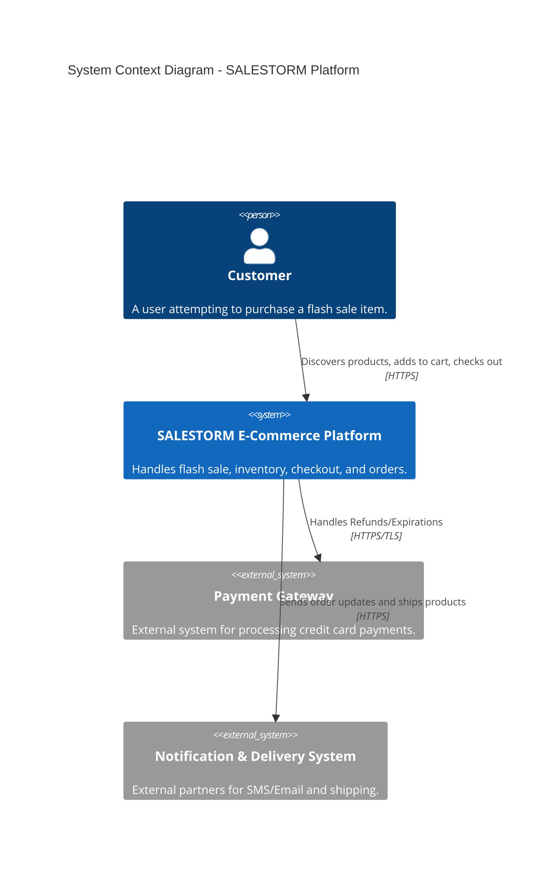

```mermaid
C4Context
title System Context Diagram - SALESTORM Platform

Person(customer, "Customer", "A user attempting to purchase a flash sale item.")
System(salestorm, "SALESTORM E-Commerce Platform", "Handles flash sale, inventory, checkout, and orders.")
System_Ext(payment_gw, "Payment Gateway", "External system for processing credit card payments.")
System_Ext(notification_svc, "Notification & Delivery System", "External partners for SMS/Email and shipping.")

Rel(customer, salestorm, "Discovers products, adds to cart, checks out", "HTTPS")
Rel(salestorm, payment_gw, "Processes payments", "HTTPS/TLS")
Rel(salestorm, payment_gw, "Handles Refunds/Expirations", "HTTPS/TLS")
Rel(salestorm, notification_svc, "Sends order updates and ships products", "HTTPS")
```
