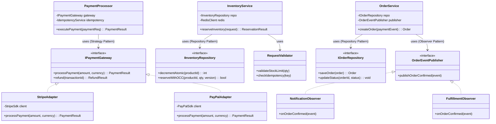

```mermaid
classDiagram
    %% Core Interfaces (Abstractions / DIP)
    class IPaymentGateway {
        <<interface>>
        +processPayment(amount, currency): PaymentResult
        +refund(transactionId): RefundResult
    }
    class IInventoryRepository {
        <<interface>>
        +decrementAtomic(productId): int
        +reserveWithOCC(productId, qty, version): bool
    }
    class IOrderRepository {
        <<interface>>
        +saveOrder(order): Order
        +updateStatus(orderId, status): void
    }

    %% Inventory Module
    class InventoryService {
        -IInventoryRepository repo
        -RedisClient redis
        +reserveInventory(request): ReservationResult
    }
    class RequestValidator {
        +validateStockLimit(qty)
        +checkIdempotency(key)
    }
    
    %% Payment Module
    class PaymentProcessor {
        -IPaymentGateway gateway
        -IdempotencyService idempotency
        +executePayment(paymentReq): PaymentResult
    }
    class StripeAdapter {
        -StripeSdk client
        +processPayment(amount, currency): PaymentResult
    }
    class PayPalAdapter {
        -PayPalSdk client
        +processPayment(amount, currency): PaymentResult
    }
    IPaymentGateway <|.. StripeAdapter
    IPaymentGateway <|.. PayPalAdapter

    %% Order Module
    class OrderService {
        -IOrderRepository repo
        -OrderEventPublisher publisher
        +createOrder(paymentEvent): Order
    }
    
    %% Events & Observers
    class OrderEventPublisher {
        <<interface>>
        +publishOrderConfirmed(event)
    }
    class NotificationObserver {
        +onOrderConfirmed(event)
    }
    class FulfillmentObserver {
        +onOrderConfirmed(event)
    }

    %% Relationships
    PaymentProcessor --> IPaymentGateway : uses (Strategy Pattern)
    InventoryService --> IInventoryRepository : uses (Repository Pattern)
    InventoryService --> RequestValidator : uses
    OrderService --> IOrderRepository : uses (Repository Pattern)
    OrderService --> OrderEventPublisher : uses (Observer Pattern)
    OrderEventPublisher <|.. NotificationObserver
    OrderEventPublisher <|.. FulfillmentObserver
```
