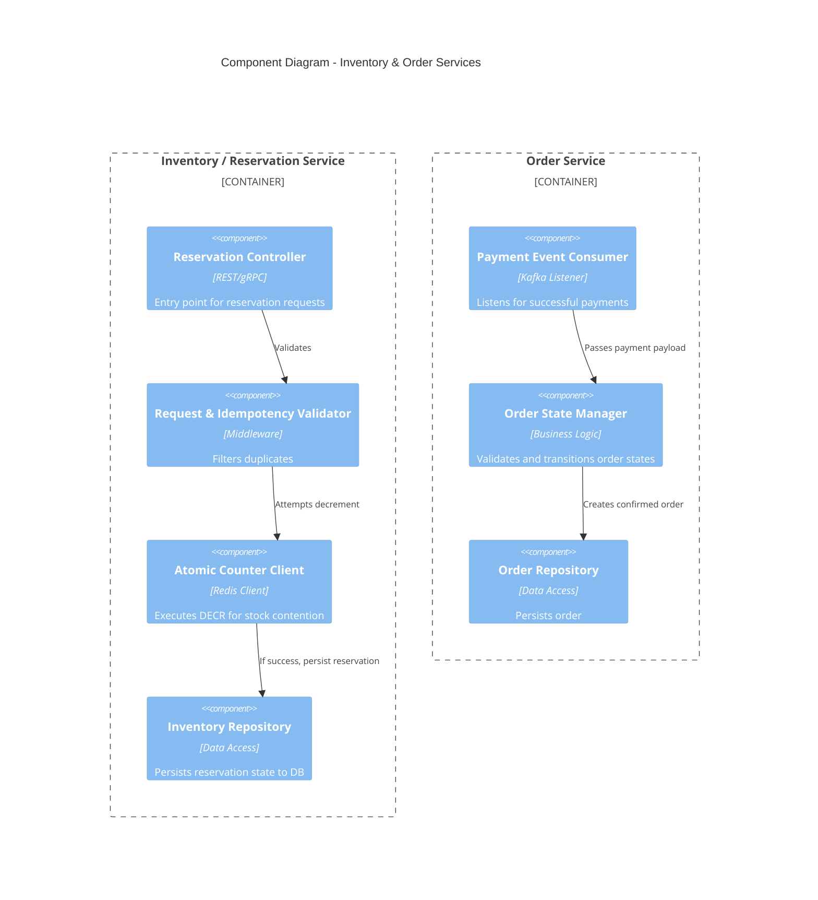

```mermaid
C4Component
title Component Diagram - Inventory & Order Services

Container_Boundary(inv_bound, "Inventory / Reservation Service") {
    Component(inv_ctrl, "Reservation Controller", "REST/gRPC", "Entry point for reservation requests")
    Component(inv_validator, "Request & Idempotency Validator", "Middleware", "Filters duplicates")
    Component(redis_client, "Atomic Counter Client", "Redis Client", "Executes DECR for stock contention")
    Component(inv_repo, "Inventory Repository", "Data Access", "Persists reservation state to DB")
    
    Rel(inv_ctrl, inv_validator, "Validates")
    Rel(inv_validator, redis_client, "Attempts decrement")
    Rel(redis_client, inv_repo, "If success, persist reservation")
}

Container_Boundary(ord_bound, "Order Service") {
    Component(order_consumer, "Payment Event Consumer", "Kafka Listener", "Listens for successful payments")
    Component(order_mgr, "Order State Manager", "Business Logic", "Validates and transitions order states")
    Component(order_repo, "Order Repository", "Data Access", "Persists order")
    
    Rel(order_consumer, order_mgr, "Passes payment payload")
    Rel(order_mgr, order_repo, "Creates confirmed order")
}
```
