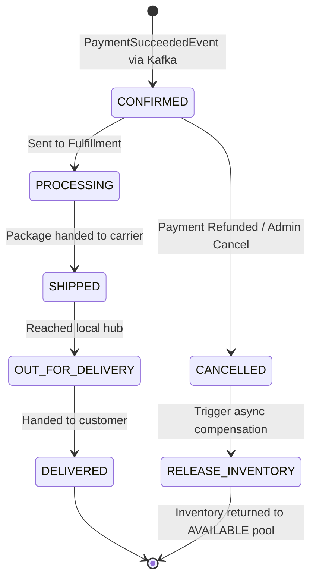

```mermaid
stateDiagram-v2
    [*] --> CONFIRMED : PaymentSucceededEvent via Kafka
    
    %% Success Path
    CONFIRMED --> PROCESSING : Sent to Fulfillment
    PROCESSING --> SHIPPED : Package handed to carrier
    SHIPPED --> OUT_FOR_DELIVERY : Reached local hub
    OUT_FOR_DELIVERY --> DELIVERED : Handed to customer
    DELIVERED --> [*]

    %% Failure & Recovery Paths
    CONFIRMED --> CANCELLED : Payment Refunded / Admin Cancel
    
    %% Post-Cancellation Action
    CANCELLED --> RELEASE_INVENTORY : Trigger async compensation
    RELEASE_INVENTORY --> [*] : Inventory returned to AVAILABLE pool
```
