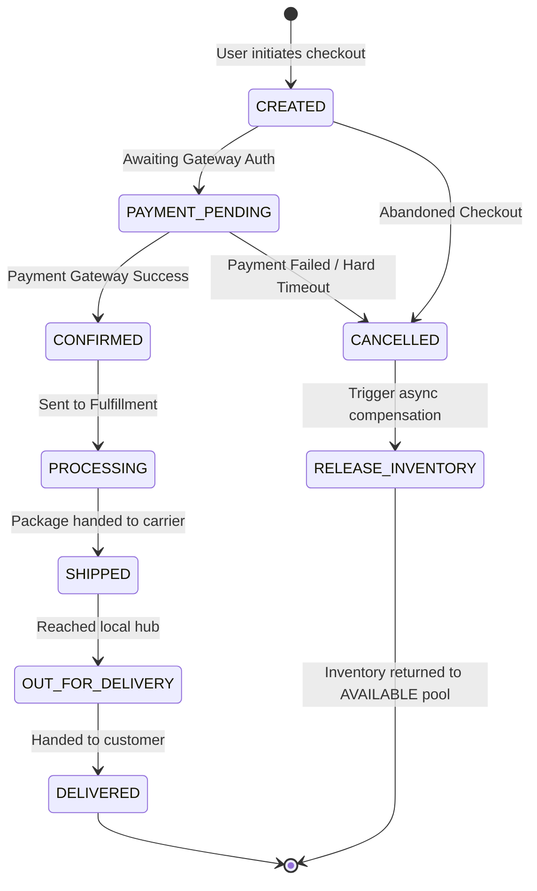

```mermaid
stateDiagram-v2
    [*] --> CREATED : User initiates checkout
    CREATED --> PAYMENT_PENDING : Awaiting Gateway Auth
    
    %% Success Path
    PAYMENT_PENDING --> CONFIRMED : Payment Gateway Success
    CONFIRMED --> PROCESSING : Sent to Fulfillment
    PROCESSING --> SHIPPED : Package handed to carrier
    SHIPPED --> OUT_FOR_DELIVERY : Reached local hub
    OUT_FOR_DELIVERY --> DELIVERED : Handed to customer
    DELIVERED --> [*]

    %% Failure & Recovery Paths
    CREATED --> CANCELLED : Abandoned Checkout
    PAYMENT_PENDING --> CANCELLED : Payment Failed / Hard Timeout
    
    %% Post-Cancellation Action
    CANCELLED --> RELEASE_INVENTORY : Trigger async compensation
    RELEASE_INVENTORY --> [*] : Inventory returned to AVAILABLE pool
```
