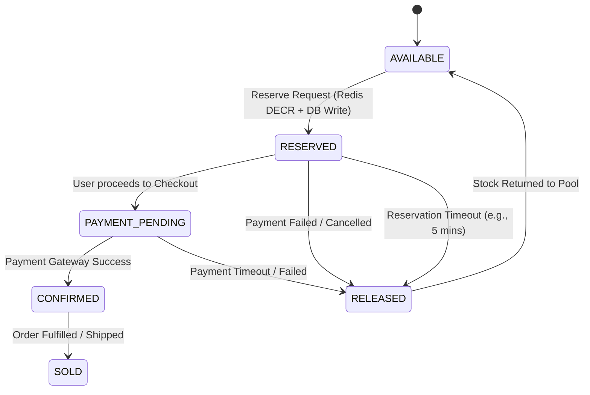

# Phase 3: Concurrency & Inventory Design

## 1. Inventory Reservation State Machine
*This diagram maps the exact lifecycle of an inventory reservation, including all critical failure and timeout paths.*

## 2. Concurrency Strategy Comparison (Database Layer)
While our Redis atomic counter (`DECR`) acts as a massive traffic shedder (bouncing 9,900 losers instantly), we still need rock-solid consistency for the 100 requests that do reach our PostgreSQL database. 

**Option 1: Pessimistic Locking (`SELECT ... FOR UPDATE`)**
* **How it works:** The database places a row-level lock on the `INVENTORY` record. Any other transaction trying to modify it must wait in a queue until the first transaction commits.
* **Trade-offs:** 
  * *Pros:* Extremely simple to reason about; zero retries required in the application layer.
  * *Cons:* Reduced throughput and risk of connection pool exhaustion if transactions are slow (e.g., waiting on external services).

**Option 2: Optimistic Concurrency Control (OCC)**
* **How it works:** We add a `version` integer column to the `INVENTORY` table. When updating, we use: `UPDATE inventory SET available = available - 1, version = version + 1 WHERE id = 1 AND version = <read_version>`. If the version has changed, the DB returns 0 affected rows, and the app must retry.
* **Trade-offs:**
  * *Pros:* Maximum throughput; no database locks held; fits perfectly with stateless microservices.
  * *Cons:* Requires the application to handle retry logic (`Thundering Herd` on retries, though Redis mitigates this here).

### 🏆 Recommendation for SALESTORM
**Optimistic Concurrency Control (OCC)** is the best choice. Because our Redis layer has already shed the extreme contention (10,000 down to ~100 concurrent writes), OCC ensures our database remains entirely lock-free and highly performant. If a collision occurs among the 100 winners, a simple application-level retry loop will cleanly resolve it in milliseconds without locking the database row.
