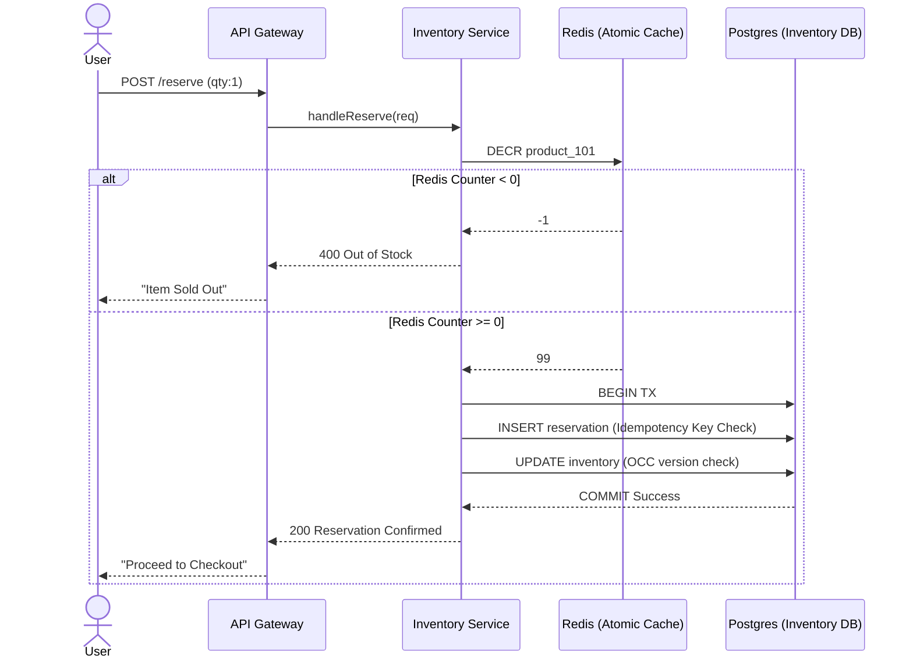
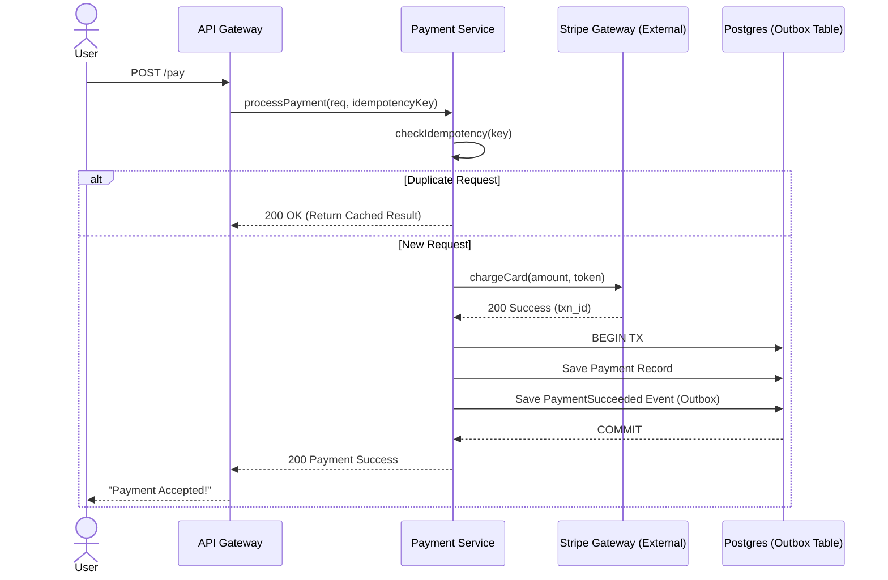
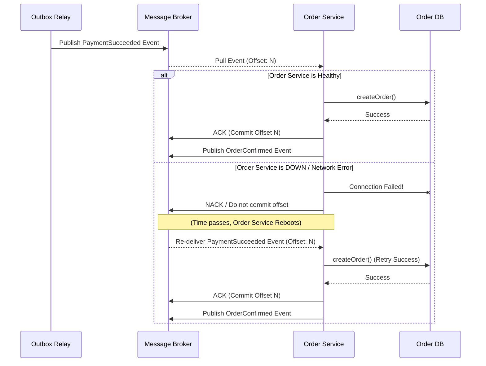

# Sequence Diagrams

## 9. Purchase / Reservation Sequence Diagram

```mermaid
sequenceDiagram
    actor User
    participant API as API Gateway
    participant InvSvc as Inventory Service
    participant Redis as Redis (Atomic Cache)
    participant DB as Postgres (Inventory DB)
    
    User->>API: POST /reserve (qty:1)
    API->>InvSvc: handleReserve(req)
    
    %% Redis acts as the traffic shedder
    InvSvc->>Redis: DECR product_101
    alt Redis Counter < 0
        Redis-->>InvSvc: -1
        InvSvc-->>API: 400 Out of Stock
        API-->>User: "Item Sold Out"
    else Redis Counter >= 0
        Redis-->>InvSvc: 99
        
        %% Database handles only the 100 successful requests
        InvSvc->>DB: BEGIN TX
        InvSvc->>DB: INSERT reservation (Idempotency Key Check)
        InvSvc->>DB: UPDATE inventory (OCC version check)
        DB-->>InvSvc: COMMIT Success
        
        InvSvc-->>API: 200 Reservation Confirmed
        API-->>User: "Proceed to Checkout"
    end
```

## 10. Payment Sequence Diagram

```mermaid
sequenceDiagram
    actor User
    participant API as API Gateway
    participant PaySvc as Payment Service
    participant Stripe as Stripe Gateway (External)
    participant DB as Postgres (Outbox Table)
    
    User->>API: POST /pay
    API->>PaySvc: processPayment(req, idempotencyKey)
    
    %% Idempotency check prevents double charges
    PaySvc->>PaySvc: checkIdempotency(key)
    alt Duplicate Request
        PaySvc-->>API: 200 OK (Return Cached Result)
    else New Request
        PaySvc->>Stripe: chargeCard(amount, token)
        Stripe-->>PaySvc: 200 Success (txn_id)
        
        %% Transactional Outbox Pattern
        PaySvc->>DB: BEGIN TX
        PaySvc->>DB: Save Payment Record
        PaySvc->>DB: Save PaymentSucceeded Event (Outbox)
        DB-->>PaySvc: COMMIT
        
        PaySvc-->>API: 200 Payment Success
        API-->>User: "Payment Accepted!"
    end
```

## 11. Order Sequence Diagram

```mermaid
sequenceDiagram
    participant Relay as Outbox Relay
    participant Kafka as Message Broker
    participant OrdSvc as Order Service
    participant DB as Order DB
    
    Relay->>Kafka: Publish PaymentSucceeded Event
    Kafka-->>OrdSvc: Pull Event (Offset: N)
    
    alt Order Service is Healthy
        OrdSvc->>DB: createOrder()
        DB-->>OrdSvc: Success
        OrdSvc->>Kafka: ACK (Commit Offset N)
        OrdSvc->>Kafka: Publish OrderConfirmed Event
    else Order Service is DOWN / Network Error
        OrdSvc-xDB: Connection Failed!
        OrdSvc->>Kafka: NACK / Do not commit offset
        
        Note over Kafka,OrdSvc: (Time passes, Order Service Reboots)
        
        Kafka-->>OrdSvc: Re-deliver PaymentSucceeded Event (Offset: N)
        OrdSvc->>DB: createOrder() (Retry Success)
        DB-->>OrdSvc: Success
        OrdSvc->>Kafka: ACK (Commit Offset N)
        OrdSvc->>Kafka: Publish OrderConfirmed Event
    end
```
