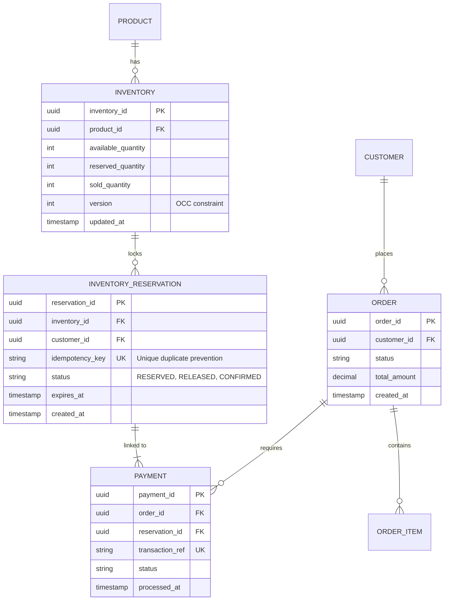

```mermaid
erDiagram
    PRODUCT ||--o{ INVENTORY : "has"
    CUSTOMER ||--o{ ORDER : "places"
    ORDER ||--o{ ORDER_ITEM : "contains"
    ORDER ||--o{ PAYMENT : "requires"
    INVENTORY_RESERVATION ||--|{ PAYMENT : "linked to"
    INVENTORY ||--o{ INVENTORY_RESERVATION : "locks"
    
    INVENTORY {
        uuid inventory_id PK
        uuid product_id FK
        int available_quantity
        int reserved_quantity
        int sold_quantity
        int version "OCC constraint"
        timestamp updated_at
    }
    
    INVENTORY_RESERVATION {
        uuid reservation_id PK
        uuid inventory_id FK
        uuid customer_id FK
        string idempotency_key UK "Unique duplicate prevention"
        string status "RESERVED, RELEASED, CONFIRMED"
        timestamp expires_at
        timestamp created_at
    }
    
    ORDER {
        uuid order_id PK
        uuid customer_id FK
        string status
        decimal total_amount
        timestamp created_at
    }
    
    ORDER_ITEM {
    }
    
    PAYMENT {
        uuid payment_id PK
        uuid order_id FK
        uuid reservation_id FK
        string transaction_ref UK
        string status
        timestamp processed_at
    }
```
